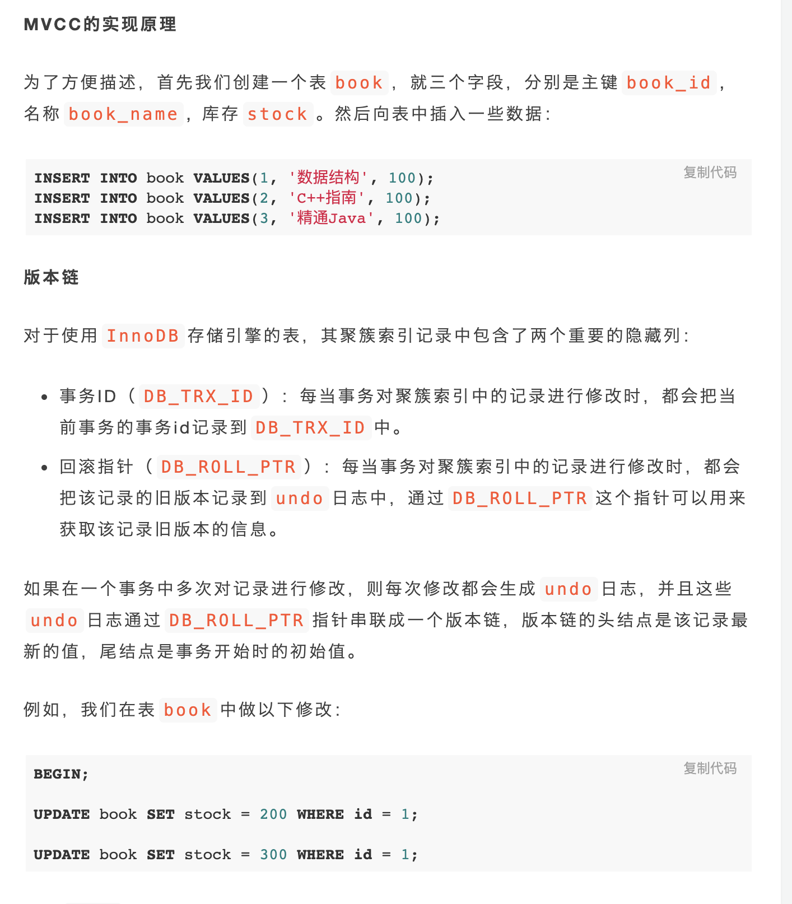
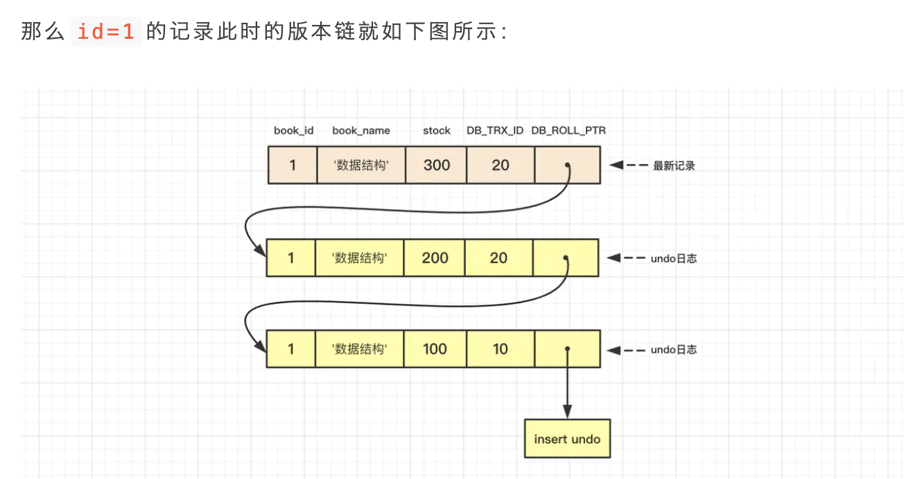

## 一.mysql事物并发导致的一些问题
### 1.读读
```
没有并发问题
```
### 2.写写
```
提交覆盖问题：一个事物提交的数据覆盖了另一个事物提交的数据
回滚覆盖问题：一个事物回滚的数据覆盖了另一个事物提交的数据
```
### 3.读/写 & 写读
```
脏读
不可重复读
幻读
```
## 二.mysql隔离级别的实现原理
```
sql规范定义了四种隔离级别，不同的数据库实现隔离级别的方式不一样。sql规范推荐使用锁来实现不同的隔离级别

```
### 1.传统隔离级别的实现-锁
#### <1.1>基本概念
```
共享锁：S锁,事物对一条数据进行读取时，需要先获取数据的共享锁 SELECT ... LOCK IN SHARE MODE 
排他锁：X锁，事物对一条数据进行写时，需要先获取数据的排他锁  SELECT  ... FOR UPDATE
间隙锁：
长锁：sql操作执行完后，等事物提交，再释放锁
短锁：sql操作执行完后，不等事物提交,立即释放锁
表锁：
页锁：
行锁：
乐观锁：
悲观锁：
```
#### <1.2>S锁和X锁的关系
```
SS共享，SX互斥，XX互斥
```
#### <1.3>基于锁的四种隔离级别的实现
```
读未提交：读操作不加锁,读读、写读、读写并行;写操作加X锁。    行锁
读已提交：读操作加S锁，写操作加X锁直到事物提交后才释放;读操作不会阻塞其他事物读或写，写操作会阻塞其他事物读或写，因此可以处理脏读问题。  行锁
可重复读：读操作加S锁事物提交后才释放，写操作加X锁事物提交后才释放；读操作不会阻塞其他事物读但会阻塞其他事物写，写操作会阻塞其他事物读或写，因此可以避免脏读和不可重复读。  行锁
串行化：读写操作都加X锁，颗粒度是表锁，即严格串行。因此可以避免脏读、不可重复读、幻读
```


### 2.mysql基于MVCC的隔离级别实现
#### <2.1>sql规范推荐使用锁来实现不同的隔离级别，mysql的隔离级别实现在基于锁实现写-写并发控制，又基于MVCC(多版本并发控制)来实现读-写并发控制
#### <2.2>MVCC的实现原理
 



### <2.3>mysql四种隔离级别的实现
```
 对于read-uncommitted每次都读取版本链最新的信息，serialiable通过加锁来实现
read-committed和repeatable通过MVVC来实现
```
### <2.4>当前读、快照读、阻塞读、非阻塞读
```
快照读：对于read-comitted repeatable两种隔离级别，每次都读取的是mvcc版本的一个快照，称为快照读；
当前读：不读取MVCC版本快照的方式称为当前读
阻塞读：不阻塞其他事物读操作，称为非阻塞读
非阻塞读：阻塞其他事物读操作，称为阻塞读
```