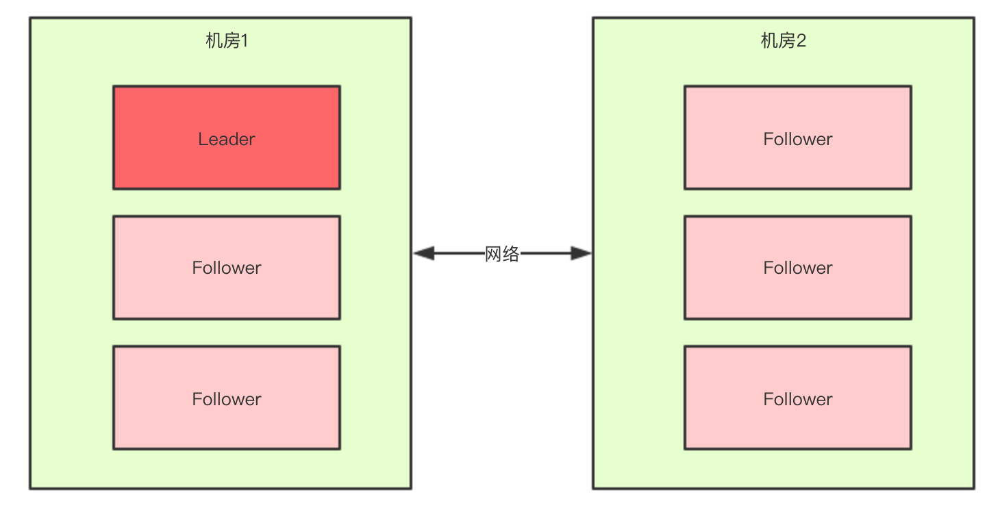
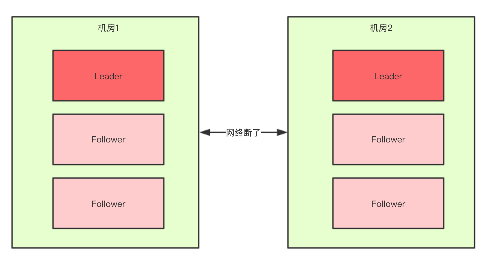

## 一.脑裂的概念
```
 脑裂通常出现在服务集群中，例如：elasticsearch集群、 zookeeper集群 他们都有个共同的大脑，例如elasticsearch的master节点 zookeeper的leader节点；当集群内部重新推选
 主节点的时候，某些场景下可能同时推举出两个主节点；这类问题称为脑裂
```

## 二.zookeeper脑裂场景分析
##### 1.zookeeper脑裂场景
```
6台zookeeper组成集群分别部署在两个机房，当两个机房间网络出现问题的时候，两个机房内的zookeeper都会重新推举新的主节点，

此时整个集群内就会出现两个主节点；等网络恢复了之后，因为两个主节点都对外提供了服务，就会出现一些列问题。
```



## 三.脑裂问题处理
##### 1.过半机制概念
```
只有当某节点被集群内半数以上的节点推举为主节点的时候，改节点才能升级为主节点


上面讲到zookeeper在特定场景下可能出现脑裂问题，但是实际上zookeeper并不会出现脑裂问题，主要是因为zookeeper
主节点选举采用了过半算法
```
###### 2.过半算法的优点
```
1.可以不用等待所有节点的选举结果，加快了主节点选举的速度
2.可以防止脑裂问题的产生
```
