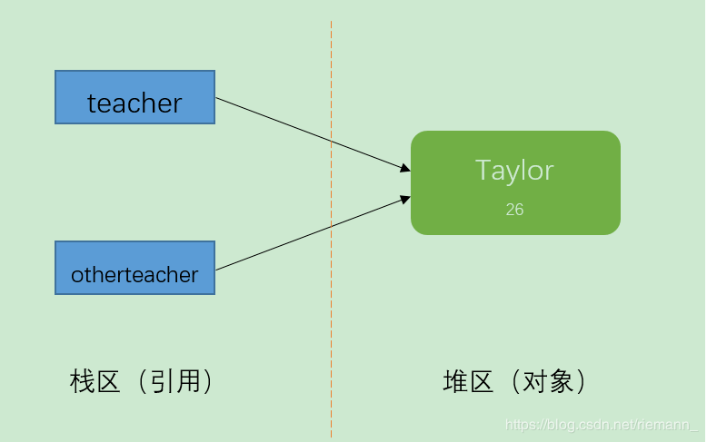
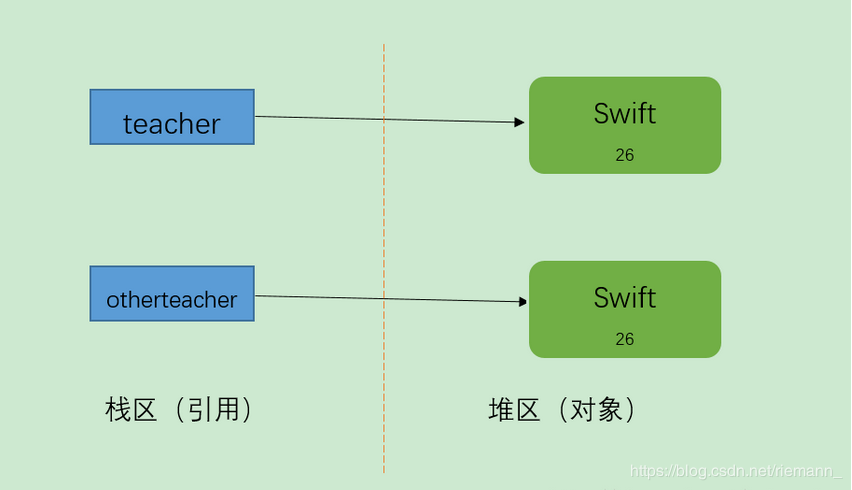
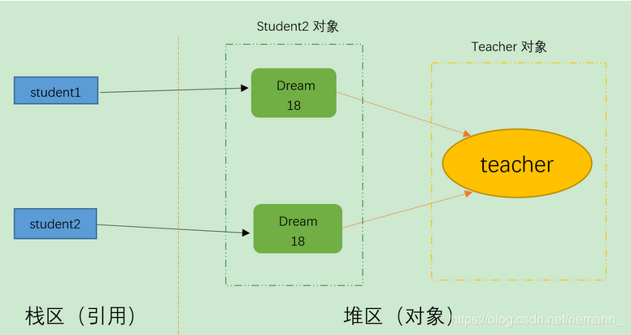
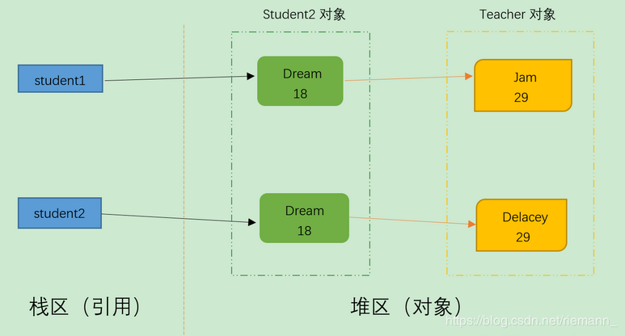

### 一.拷贝的概念
#### 1.概念：拷贝是指将一个对象的成员变量的值复制到另一个对象上
### 二.拷贝的分类
#### 1.引用拷贝
```
概念：引用拷贝拷贝的是对象的地址,拷贝后的两个对象的地址一样
```

### 2.对象拷贝
```
概念：对象拷贝拷贝的是对象的值，拷贝后两个对象的值一样，但是内存地址不一样
```

#### 2.1对象拷贝分类
##### 2.2.1)浅拷贝
```
浅拷贝，仅仅复制对象本身，而不复制对象内部属性引用的对象
```

##### 2.2.2)深拷贝
```
深拷贝，不只复制对象，还复制对象内部所引用的对象
```


### 三.拷贝的实现
```
1.对象实现Cloneable接口并且重写clone()方法
2.实际使用的时候可以通过object*.clone()来进行对象的拷贝
```

