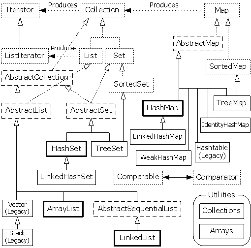
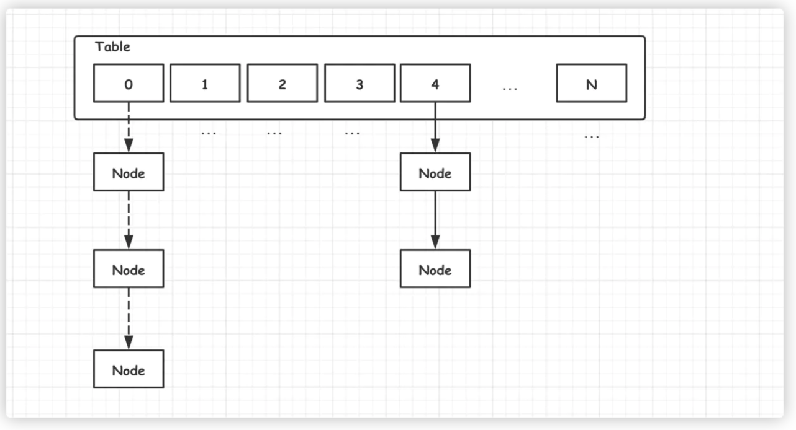
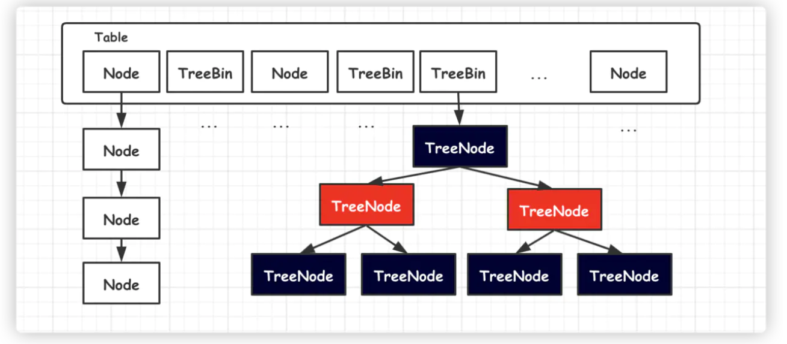

## 一.java集合分类



## 三.Iterator方法说明
```
1.Collections的实现类都可以使用iterator进行数据遍历
2.iterator主要提供hasNext() 、next() 、remove() 这3个方法

```

## 四.常见问题
### 1.HashMap初始容量？负载因子？如何扩容？
```
负载因子概念：负载因子表示hash表中元素的填满情况
```
```
1）HashMap初始容量16
2) 负载因子：0.75，原因：泊松分布，0.75的情况下hash碰撞最小
3）扩容：当hashMap中的元素个数>容量*负载因子，初始情况下即:元素个数>16*0.75=12的情况下，hashMap就会进行扩容，且默认照着2N（N为当前容量）进行扩容
4)hash碰撞：
```
### 2.hashMap put() get()的执行过程?hash碰撞发生如何处理
```
1)根据key调用key的hash方法获取hashCode--->根据hashCode获取数据的存储位置（桶）,然后在桶内通过equals()方法进行比较最终
2）
```
### 2.hashMap结构
#### 2.1.jdk1.7数组+链表

#### 2.2.jdk1.8数组+链表+红黑树（链表元素超过8后将自动转为红黑树)


### 3.concurrentHashMap结构

### 4.TreeMap HashMap HashTable的区别
```
1.treeMap是有序的，HashMap HashTable 是无序的
2.HashTable是线程安全的，HashMap线程不安全
3.HashMap可以接收null值，HashTable不可以
4.HashTable效率较HashMap低
```