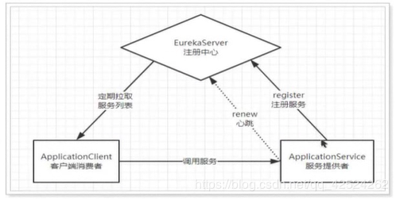
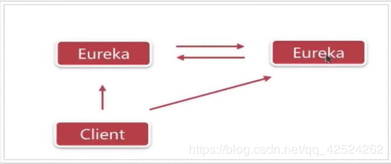

### 一.为什么要使用服务注册与发现

```
     采用微服务架构的情况下，当某个服务ip|端口地址发生改变时，需要同步更改其他依赖它的服务的配置。如果只是一个服务Ip|端口变更，我们还能手动去做配置信息的更改；
  但是如果多个服务ip|端口信息都发生了变动，这个时候手动去做配置信息的更改明显不现实。
```


### 二.eureka的主要功能

##### 1.eureka主要包括eureka-server和eureka-client两部分
##### 2.eureka-server主要功能：服务注册、提供服务注册表、同步client状态
###### 2.1)服务注册
```
服务提供者启动时，会通过eureka-client向eureka-server注册服务信息，eureka-server会存储这些服务信息
```
###### 2.2)提供服务注册表
```
服务消费者在调用服务时，如果eureka-client没有缓存服务注册表，会从eureka-server获取最新的服务注册表信息
```
###### 2.3)同步client状态
```
eureka-client通过注册、心跳机制，向eureka-server同步服务状态
```
##### 3.eureka-client主要功能：服务注册、服务续约、获取服务注册表信息、服务下线、服务剔除
###### 3.1）服务注册
```
服务提供者，通过eureka-client向eureka-server注册服务信息。当eureka-client向eureka-server注册时主要提供自身的ip、端口、主页、url、运行状况指示符
```
###### 3.2)服务续约
```
服务提供者，通过心跳检测机制定期向eureka-server汇报服务运行状况；eureka-client默认每隔30s会向eureka-server发送一次心跳来续约;eureka-server默认在90s内没有
收到eureka-client的心跳，默认会将其从服务注册表剔除。

## 服务续约任务的调用间隔时间，默认为30秒
eureka.instance.lease-renewal-interval-in-seconds=30

## 服务失效的时间，默认为90秒。
eureka.instance.lease-expiration-duration-in-seconds=90
```
###### 3.3)获取服务注册表信息
```
eureka-client默认每隔30s从eureka-server获取服务注册表信息

# 启用服务消费者从注册中心拉取服务列表的功能
eureka.client.fetch-registry=true

# 设置服务消费者从注册中心拉取服务列表的间隔
eureka.client.registry-fetch-interval-seconds=30
```
##### 3.4)服务下线
```
eureka-client在服务关闭前通知eureka-server将其从服务注册表中移除。调用方法：
DiscoveryManager.getInstance().shutdownComponent()；
```

##### 3.5)服务剔除
```
eureka-client和eureka-server间没有心跳时，eureka-server会将其从服务注册表内移除，即：服务剔除
```

### 三.eureka实战
##### 1.eureka自我保护模式
###### 1.1)[自我保护模式的触发条件](https://www.cnblogs.com/xishuai/p/spring-cloud-eureka-safe.html)
```
当eureka-server在某个时间断内心跳失败比例达到85%的时候，eureka-server会开启自我保护模式。
```
```
Renews threshold：eureka-server期望收到的心跳检测请求个数
Renews (last min)：eureka-server实际收到的心跳检测请求个数
自我保护模式被激活的条件是：在 1 分钟后，Renews (last min) < Renews threshold。
```
###### 1.2)自我保护模式下eureka-server的表现
```
1.eureka-server不会将心跳同步失败的client移出服务注册表
2.eureka-server仍然能接收新的client的服务注册续约，但是不会将新服务注册的信息同步到其他节点上（保证当前节点的可用性）
3.网络恢复后,eureka-server会将新client的服务信息同步到其他节点
```
###### 1.3）自我保护机制的作用
```
   eureka-server自我保护机制主要是为了防止误杀服务而提供的一种机制。当eureka-server部分客户端心跳失败时，eureka-server会将client踢出服务列表；
而当eureka-server内存在大量的服务心跳失败的情况，肯能是网络问题；当客户端心跳同步正常后,eureka会自动关闭自我保护模式。
   如果在eureka-server自我保护模式期间，某些服务刚好下线了，此时服务消费者会去调用一个无效的服务实例，即会调用失败。对于这种情况客户端需要一些容错机制，
例如：重试、熔断等。   
```
###### 1.4)如何处理eureka-server自我保护机制
```
1)关闭eureka-server自我保护机制eureka.server.enable-self-preservation = false [不推荐]
2）降低renewalPercentThreshold的比例，eureka.server.renewal-percent-threshold = 0.5 [不推荐]
```

##### 2.eureka高可用：eureka集群
###### 1)eureka集群


###### 2）eureka集群搭建
```
eureka-server本身也支持注册，搭建集群的时候，只需要将eureka-server同时当作一个eureka-client也向其他eureka-server
节点进行注册就可以了
```


### 四.基于eureka的负载均衡
```
    feign和ribbon都是spring-cloud提供的用于负载均衡的模块;ribbon支持httpClient和restTemplate的调用方式;feign对ribbon做了二次封装,采用抽象接口的方式实现了垮服务的
 接口调用
```


### 五.eureka zookeeper的对比
