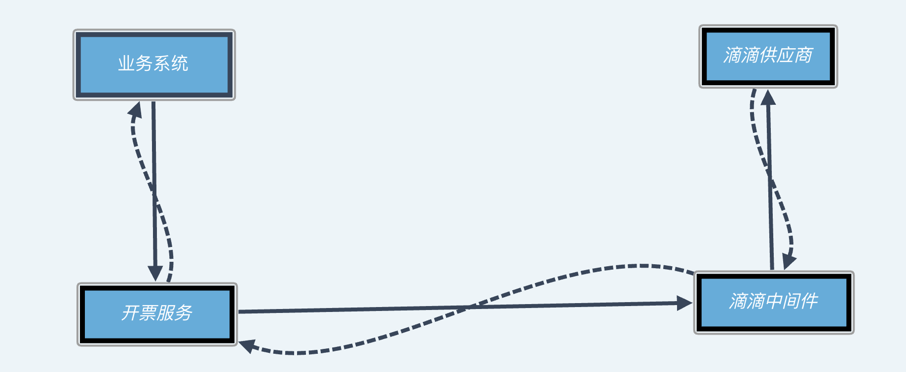

## 一.业务背景
```
  员工期望少贴票，财务期望员工提供合规的发票，统一开票同时解决了这两个痛点。
```
   
## 二.业务架构

#### 1.业务架构
```
业务系统、开票服务 、滴滴中间件、滴滴供应商
```
```
 1.开票模块从业务系统筛选待开票的订单数据，经由滴滴中间件传输给滴滴供应商去帮用户开具发票。
 2.开票模块根据最终订单的开票结果，对业务系统的数据进行调整。例如：开票失败费用驳回，单据开票通过、单据开票驳回
```

#### 2.开票模块主要的业务功能
```
支持的供应商：
1.神舟
2.滴滴
3.京东
4.公司自营商旅平台：甄选酒店费用开票
```

```
功能角度：
1.手动开票
2.一键开票
3.开票历史查询
4.开票进度查询

```

## 三.业务功能实现
```

```

## 四.代码架构
#### 1.框架：springCloud + springBoot + redis + 
```

```


## 五.遇到的问题
##### 1.供应商接口较慢,串行开票客户等待时间过久
```
```
##### 2.数据预处理
```
先前业务端存在部分数据没有公司、部门、法人等开票纬度的数据，导致实际开票数据的统计结果不
```


## 六.项目带来的收益
##### 1.为客户公司节省了人力，保障了员工打车相关数据的透明化
```
节约了员工贴票的时间，节省了财务审查发票的工作量
```

##### 2.年均开票额度在1亿左右，客户反馈良好