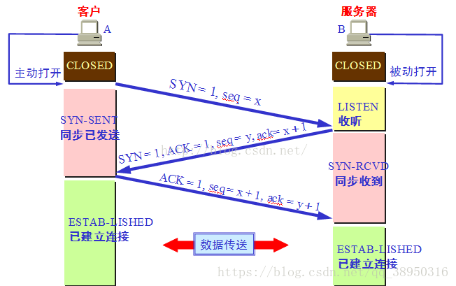

## 一.七层网络模型
### 1.OSI七层网络模型
```
1）物理层 
2）数据链路层
3）网络层
4）传输层
5）会话层
6）表示层
7）应用层
```
### 2.OSI七层网络模型的优点
```
1)不同的层做不同的事
2）上层变动，不影响下层
```


## 3.TCP/IP 四层网络模型
```
1)网络接口层 
2)网间层 （网络层）
3)传输层 （传输层）
4)应用层（会话层、表达层、应用层）
```


## 4.TCP/IP和OSI七层网络模型的区别
```
1)TCP/IP没有物理层和数据链路层
```

## 二.tcp udp区别 
```
1.tcp是面向链接的(三次握手、四次挥手）,udp不是面向链接的（只管发）
2.tcp保证数据的正确性，UDP可能丢包
3.tcp保证数据顺序，UDP不保证数据的顺序性
```

## 三.http三次握手、四次挥手
### 1.三次握手建立链接

### 2.四次挥手释放链接

### 3.http报文结构
#### 1)请求报文
```
请求行 ---请求方式（GET|POST...) 、请求URI 、协议版本号
请求头
空行
请求体
```


#### 2)响应报文
```
响应行 ---- 协议版本号 、请求状态码
响应头 
空行
响应体
```


## 四.http https 
### 1.http的缺点
```
1)http报文不加密，可能被拦截
2）http不验证客户端身份信息，可能遭遇伪装客户端
3）http不验证报文的一致性，可能被篡改
4）http默认端口号80

```
### 2.https
```
1）http + (报文加密 + 身份验证 + 报文一致校验)SSL  = https
2）https默认端口号443
```


## 五.http和webSocket的区别
### 1.http是半双工通信，webSocket是全双工通信,webSocket是http半双工协议的补充
```
http必须必须是客户端做了请求，服务端才能被动相应；
webSocket客户和服务端在建立了链接后，可以互相通过tcp协议自由通信
```
### 2.如果需要发送多个http请求，客户端服务端之间需要建立多次链接（多次三次握手、四次挥手),webSocket只需要建立一次链接，客户端服务端间
就可以随意通信

## 六.http的报文结构及http1.0 2.0 区别
##### 1.http报文结构

```
1)请求行
3个字段:方法字段、URL字段和HTTP版本字段
GET /{url} HTTP/1.1
2）请求头
3）请求体
```

##### 2.http1.0 http1.1 http2.0的区别
###### 1.http1.0 http1.1的区别
```
1)缓存策略：http1.1支持更多的缓存策略
2）带宽和资源的利用率：http1.0客户端只能请求资源的全部内容，不支持客户端请求资源的部分内容；http1.1支持客户端亲求资源的部分内容，支持断点续传
3）host：http1.0 header里不支持host参数，http1.1亲求头支持host参数
4)长链接：http1.1支持长链接，即：多个http请求串行的共用一个tcp管道
5）支持的链接错误：http新增了24个错误状态码。（409请求资源的状态和资源的当前状态存在冲突 410请求资源被永久删除）
```

###### 2.http1.X和http2.0的区别
```
1）数据传输格式：http1.X是基于文本的数据传输，http2.0数据是以二进制的形式传输
1) 多陆复用：http2.0支持基于一个tcp管道，并行多个请求
2）数据传输加密：http2.0实现了基于https的报文加密
3）header压缩：http2.0对header进行了压缩，节约了带宽
4）服务端推送:http2.0支持服务端推送数据给客户端
```
```
服务端推送的概念：
我们在nghttpx模块中实现了HTTP/2服务器推送功能，并且在我们的nghttp2.org网站中启用了该推送功能。当你通过HTTP/2协议访问 https://nghttp2.org网站时，CSS文件/stylesheets/screen.css就会被推送到客户端
```

###### 3.http2.0的多路复用和http1.1长链接的区别
```
1)http2.0多路复用基于一个tcp管道建立的链接是并行的
2）http1.1长链接基于tcp管道建立的链接是串行的
```


